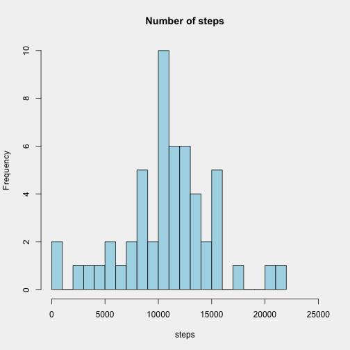
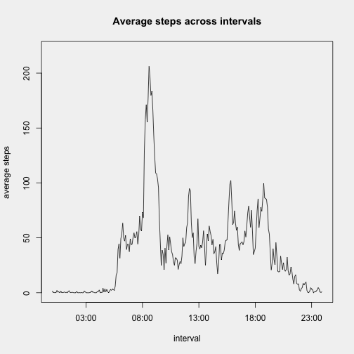
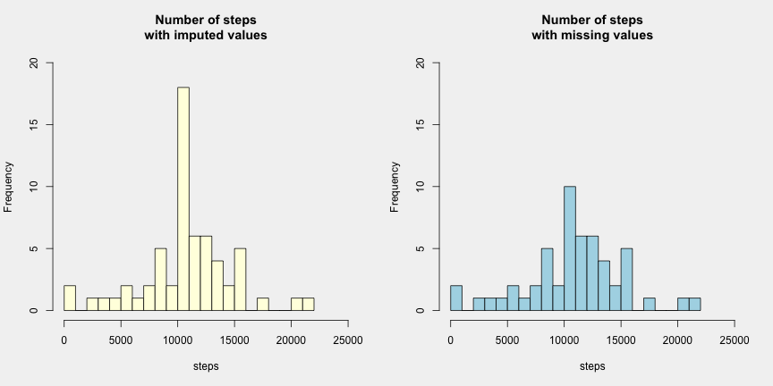
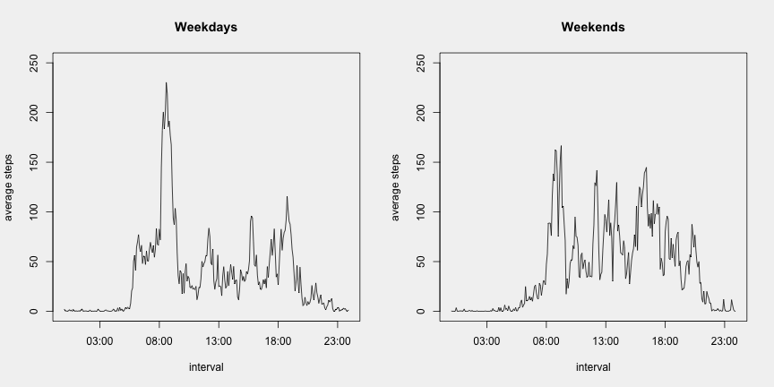

# Personal movement activity


```r
library(stringr)
library(lubridate)
library(dplyr)
library(readr)
```

### 1. Code for reading in the dataset and/or processing the data


```r
df <- read.csv("activity.csv")
```

```
## Warning in file(file, "rt"): cannot open file 'activity.csv': No such file or directory
```

```
## Error in file(file, "rt"): cannot open the connection
```

```r
head(df)
```

```
##   steps       date interval parsed.interval
## 1    NA 2012-10-01   000000        00:00:00
## 2    NA 2012-10-01   000500        00:05:00
## 3    NA 2012-10-01   001000        00:10:00
## 4    NA 2012-10-01   001500        00:15:00
## 5    NA 2012-10-01   002000        00:20:00
## 6    NA 2012-10-01   002500        00:25:00
```

A closer look at the <tt>interval</tt> variable reveals that the intervals represent the time of the day in hours and minutes, with omitted leading zeros: in the first row of the data frame we thus have the number of steps taken on October 1, 2012, between 00:00 and 00:05 (i.e. between midnight and five minutes past midnight).


```r
df[1000:1010,]
```

```
##      steps       date interval parsed.interval
## 1000     0 2012-10-04   111500        11:15:00
## 1001     0 2012-10-04   112000        11:20:00
## 1002   180 2012-10-04   112500        11:25:00
## 1003    21 2012-10-04   113000        11:30:00
## 1004     0 2012-10-04   113500        11:35:00
## 1005     0 2012-10-04   114000        11:40:00
## 1006     0 2012-10-04   114500        11:45:00
## 1007     0 2012-10-04   115000        11:50:00
## 1008     0 2012-10-04   115500        11:55:00
## 1009   160 2012-10-04   120000        12:00:00
## 1010    79 2012-10-04   120500        12:05:00
```

From the data frame snippet above we see, for example, that on October 4, 2012, the subject took 180 steps between 11:25 and 11:30. We can now proceed to aggregate the data and compute the total number of steps taken in each day, and use the outcome to create a histogram. 


```r
df_agg <- aggregate(df$steps, list(date=df$date), sum)
names(df_agg)[names(df_agg)=="x"] <- "steps"
head(df_agg)
```

```
##         date steps
## 1 2012-10-01    NA
## 2 2012-10-02   126
## 3 2012-10-03 11352
## 4 2012-10-04 12116
## 5 2012-10-05 13294
## 6 2012-10-06 15420
```

### 2. Histogram of the total number of steps taken each day
The difference between histogram and bar plot is important here. We should bear in mind that our goal is not to plot the date on the x-axis and the total number of steps on the y-axis, but rather to create bins of number of steps (whereby the size of the bins is arbitrary) in order to represent the frequency (count) of a certain range of steps (e.g., how many days did the subject take a number of steps that lies between 4000 and 5000?).  


```r
par(bg = 'gray95')
with(df_agg, hist(steps, breaks=20, col="lightblue", xlim = c(0, 25000),
                  main="Number of steps"))
```



The histogram tells us, for example, that there are 10 days in which the number of steps taken was between 10000 and 11000, and 1 day in which that number was between 4000 and 5000. It is important to point out that NA values are ignored, therefore the days in which all the intervals have value NA are not displayed (8 days are missing from the total count).

### 3. Mean and median number of steps taken each day

```r
mean_steps <- round(mean(df_agg$steps, na.rm=TRUE), digits=0)
print(paste("Mean of steps taken each day (rounded to integer):", mean_steps))
```

```
## [1] "Mean of steps taken each day (rounded to integer): 10766"
```

```r
median_steps <- median(df_agg$steps, na.rm=TRUE)
print(paste("Median of steps taken each day:", median_steps))
```

```
## [1] "Median of steps taken each day: 10765"
```

```r
total_steps <- sum(df_agg$steps, na.rm=TRUE)
print(paste("Total number of steps:", total_steps))
```

```
## [1] "Total number of steps: 570608"
```

### 4. Time series plot of the average number of steps taken
The aim of this plot is to show all the 5-minute intervals in one day on the x-axis, and on the y-axis the average of steps taken in each given interval (the average is computed over the entire two-month period). We want to be able to answer questions such as: "What's the average of steps taken in the interval between 9:25 and 9:30, over the two months?"  
The number of intervals in one day is 12 x 24 = 288 (there are 12 intervals in one hour and 24 hours in a day). In order to enable the conversion to a datetime object, we pad the interval with leading zeros (to give the format HHMM) and with trailing zeros (which results in the format HHMMSS).


```r
df$interval <- str_pad(df$interval, width=4, side="left", pad="0")
df$interval <- str_pad(df$interval, width=6, side="right", pad="0")
head(df)
```

```
##   steps       date interval parsed.interval
## 1    NA 2012-10-01   000000        00:00:00
## 2    NA 2012-10-01   000500        00:05:00
## 3    NA 2012-10-01   001000        00:10:00
## 4    NA 2012-10-01   001500        00:15:00
## 5    NA 2012-10-01   002000        00:20:00
## 6    NA 2012-10-01   002500        00:25:00
```

We then aggregate the data to obtain the average number of steps taken in each interval, over the two months, and we convert the interval into the format HH:MM:SS


```r
df_agg_int <- aggregate(df$steps, list(interval=df$interval), mean, na.rm=TRUE)
df_agg_int$interval <- parse_time(df_agg_int$interval, "%H%M%S")
names(df_agg_int)[names(df_agg_int)=="x"] <- "avg.steps"
df_agg_int$avg.steps <- round(df_agg_int$avg.steps, digits=2)
tail(df_agg_int)
```

```
##     interval avg.steps
## 283 23:30:00      2.60
## 284 23:35:00      4.70
## 285 23:40:00      3.30
## 286 23:45:00      0.64
## 287 23:50:00      0.23
## 288 23:55:00      1.08
```

We can see, for example, that in the interval between 23:30 and 23:35, the average number of steps taken is 2.60. Now we create a time series. In order to enable the creation of the plot, we need a dummy date (in this case "2001-01-01"), though this date has no actual meaning.


```r
df_agg_int <- mutate(df_agg_int, time_series = ymd_hms(paste("2001-01-01", interval)))
```


```r
par(bg = 'gray95')
with(df_agg_int, plot(time_series, avg.steps, type = 'l',
                      xlab = "interval", ylab = "average steps", ylim=c(0, 220),
                      main = "Average steps across intervals"))
```



The graph shows that, on average, there is a peak in the number of steps taken somewhere between 08:00 and 09:00, whereas the average is very close to zero in the intervals between midnight and 06:00.
The next chunk, which is not evaluated, can be used as an alternative to the previous one, in case we want to plot the difference from the mean instead of the value. The shape of the plot will be the same, only the scale on the y-axis will change.


```r
# The next two lines will compute the difference between the average number of 
# steps for one inerval and the mean number of steps across all intervals.
g <- mean(df_agg_int$avg.steps)
df_agg_int <- mutate(df_agg_int, diff = avg.steps - g)

with(df_agg_int, plot(time_series, diff, type = 'l',
                      xlab = "interval", ylab = "average steps"))
```


### 5. The 5-minute interval that, on average, contains the maximum number of steps
We can find out more precisely which 5-minute interval has the maximum average of steps taken.


```r
max_steps <- df_agg_int[which.max(df_agg_int$avg.steps), c(1,2)]
print(max_steps)
```

```
##     interval avg.steps
## 104 08:35:00    206.17
```

### 6. Code to describe and show a strategy for imputing missing data

Let's take a look at the original data frame:


```r
parsed.interval <- parse_time(df$interval, "%H%M%S")
df <- cbind(df, parsed.interval)
head(df)
```

```
##   steps       date interval parsed.interval parsed.interval
## 1    NA 2012-10-01   000000        00:00:00        00:00:00
## 2    NA 2012-10-01   000500        00:05:00        00:05:00
## 3    NA 2012-10-01   001000        00:10:00        00:10:00
## 4    NA 2012-10-01   001500        00:15:00        00:15:00
## 5    NA 2012-10-01   002000        00:20:00        00:20:00
## 6    NA 2012-10-01   002500        00:25:00        00:25:00
```

We observe missing values for some of the intervals, and we can find out that their number is 2304:


```r
print(paste("Total number of entries (intervals):", length(df$steps)))
```

```
## [1] "Total number of entries (intervals): 17568"
```

```r
table(is.na(df$steps))
```

```
## 
## FALSE  TRUE 
## 15264  2304
```

Similarly, in the aggregated data frame we can find out that there are 8 days in which data are missing for all the intervals (one example is 2012-10-01):


```r
head(df_agg)
```

```
##         date steps
## 1 2012-10-01    NA
## 2 2012-10-02   126
## 3 2012-10-03 11352
## 4 2012-10-04 12116
## 5 2012-10-05 13294
## 6 2012-10-06 15420
```

```r
print(paste("Total number of entries (days):", length(df_agg$steps)))
```

```
## [1] "Total number of entries (days): 61"
```

```r
table(is.na(df_agg$steps))
```

```
## 
## FALSE  TRUE 
##    53     8
```

One possible strategy to impute missing data could be to replace all the missing intervals with the mean number of steps for that particular interval over the two months.


```r
# Initialize counters
i <- 1
j <- 1

# Create empty vectors which will be variables in 
# a data frame used to record imputed values
ID <- vector()
ID_NA <- vector()
date <- vector()
interval <- vector()
imputed_value <- vector()

# Create an empty vector for the
# variable that will replace df$steps
new_steps <- vector()

for (item in df$steps) {
  if (is.na(item)) {
    k <- df_agg_int$avg.steps[match(df$parsed.interval[i], df_agg_int$interval)]
    ID <- c(ID, i)
    ID_NA <- c(ID_NA, j)
    date <- c(date, as.character(df$date[i]))
    interval <- c(interval, as.character(df$parsed.interval[i]))
    imputed_value <- c(imputed_value, k)
    j <- j+1
    # If value is NA, add the imputed value
    new_steps <- c(new_steps, k)
  }
  # If value is not NA, keep the existing value
  else {new_steps <- c(new_steps, item)}
  i <- i+1
}
```

Just as a sanity check, with the output of the code above we can create a data frame with all the imputed values, where ID indicates the row number in the data frame with all the intervals and ID_NA indicates the row number in the data frame that subsets only the NA values (which has 2304 entries).


```r
df_impute <- data.frame(ID, ID_NA, date, interval, imputed_value)
dim(df_impute)
```

```
## [1] 2304    5
```

```r
tail(df_impute)
```

```
##         ID ID_NA       date interval imputed_value
## 2299 17563  2299 2012-11-30 23:30:00          2.60
## 2300 17564  2300 2012-11-30 23:35:00          4.70
## 2301 17565  2301 2012-11-30 23:40:00          3.30
## 2302 17566  2302 2012-11-30 23:45:00          0.64
## 2303 17567  2303 2012-11-30 23:50:00          0.23
## 2304 17568  2304 2012-11-30 23:55:00          1.08
```

We can see, for example, that the missing number of steps for the interval from 23:30:00 to 23:35:00 has been imputed with the mean value of steps for the same interval in the entire period of two months. I have decided not to round the imputed values to be integers.
A vector <tt>new_steps</tt> has been created, with the variable <tt>df$steps</tt> now updated with the imputed value.


```r
length(new_steps)
```

```
## [1] 17568
```

```r
head(new_steps)
```

```
## [1] 1.72 0.34 0.13 0.15 0.08 2.09
```

```r
df_new <- cbind(df, new_steps)
head(df_new)
```

```
##   steps       date interval parsed.interval parsed.interval new_steps
## 1    NA 2012-10-01   000000        00:00:00        00:00:00      1.72
## 2    NA 2012-10-01   000500        00:05:00        00:05:00      0.34
## 3    NA 2012-10-01   001000        00:10:00        00:10:00      0.13
## 4    NA 2012-10-01   001500        00:15:00        00:15:00      0.15
## 5    NA 2012-10-01   002000        00:20:00        00:20:00      0.08
## 6    NA 2012-10-01   002500        00:25:00        00:25:00      2.09
```

We can now proceed to aggregate the new data, visualize the histogram with imputed values and compare it to the one in section 2 (with missing values):


```r
df_agg_new <- aggregate(df_new$new_steps, list(date=df_new$date), sum)
names(df_agg_new)[names(df_agg_new)=="x"] <- "steps"
df_agg_new$steps <- round(df_agg_new$steps, digits=0)
head(df_agg_new)
```

```
##         date steps
## 1 2012-10-01 10766
## 2 2012-10-02   126
## 3 2012-10-03 11352
## 4 2012-10-04 12116
## 5 2012-10-05 13294
## 6 2012-10-06 15420
```


```r
par(bg='gray95', mfrow=c(1, 2))
with(df_agg_new, hist(steps, breaks=20, col="lightyellow",
                      xlim=c(0, 25000), ylim=c(0, 20),
                      main="Number of steps\nwith imputed values")) 
with(df_agg, hist(steps, breaks=20, col="lightblue",
                  xlim = c(0, 25000), ylim=c(0, 20),
                  main="Number of steps\nwith missing values"))
```



We observe that the count for the range between 10000 and 11000 has increased from 10 to 18. We can interpret this by stating the following: after imputing the data, the 8 days where all the intervals were NA fall in the range 10000-11000 steps. A closer look at the data frame reveals, unsurprisingly, that they actually got a number of steps = 10766, which is the mean value computed in Section 3.


```r
mean_steps_new <- round(mean(df_agg_new$steps), digits=0)
print(paste("Mean of steps taken each day (rounded to integer):", mean_steps_new))
```

```
## [1] "Mean of steps taken each day (rounded to integer): 10766"
```

```r
median_steps_new <- median(df_agg_new$steps)
print(paste("Median of steps taken each day:", median_steps_new))
```

```
## [1] "Median of steps taken each day: 10766"
```

```r
total_steps_new <- sum(df_agg_new$steps, na.rm=TRUE)
print(paste("Total number of steps:", total_steps_new))
```

```
## [1] "Total number of steps: 656736"
```

After we impute the missing data, there is no change in the mean, and the median increased only by 1. The total number of steps increased from 570608 to 656736. The difference (86128) matches the product of the mean (10766) and the number of missing days (8).
We would have obtained a different result if the NA values had been converted to 0 instead of being ignored. In that case, the 8 missing days would have 0 steps, wich would result in lower values of mean and median.

### 8. Panel plot comparing the average number of steps taken per 5-minute interval across weekdays and weekends


```r
df_new$date <- as.Date(df_new$date, format="%Y-%m-%d")
df_new$days <- ifelse(weekdays(df_new$date) %in%
                        c("Saturday", "Sunday"), "weekend", "weekday")
head(df_new)
```

```
##   steps       date interval parsed.interval parsed.interval new_steps    days
## 1    NA 2012-10-01   000000        00:00:00        00:00:00      1.72 weekday
## 2    NA 2012-10-01   000500        00:05:00        00:05:00      0.34 weekday
## 3    NA 2012-10-01   001000        00:10:00        00:10:00      0.13 weekday
## 4    NA 2012-10-01   001500        00:15:00        00:15:00      0.15 weekday
## 5    NA 2012-10-01   002000        00:20:00        00:20:00      0.08 weekday
## 6    NA 2012-10-01   002500        00:25:00        00:25:00      2.09 weekday
```


```r
df_days <- aggregate(df_new$new_steps,
                     list(day=df_new$days, interval=df_new$interval), mean)
names(df_days)[names(df_days)=="x"] <- "avg.steps"
df_days$avg.steps <- round(df_days$avg.steps, digits=2)
head(df_days)
```

```
##       day interval avg.steps
## 1 weekday   000000      2.25
## 2 weekend   000000      0.22
## 3 weekday   000500      0.45
## 4 weekend   000500      0.04
## 5 weekday   001000      0.17
## 6 weekend   001000      0.02
```

```r
dim(df_days)
```

```
## [1] 576   3
```

We now have 576 rows, because for each of the 288 intervals there are two observations (one for weekdays and one for weekends).


```r
df_days <- mutate(df_days, time_series = ymd_hms(paste("2001-01-01", interval)))
```


```r
par(bg='gray95', mfrow=c(1, 2))
with(subset(df_days, day=="weekday"), plot(time_series, avg.steps, type = 'l',
                      xlab = "interval", ylab = "average steps",
                      ylim=c(0, 250), main="Weekdays"))
with(subset(df_days, day=="weekend"), plot(time_series, avg.steps, type = 'l',
                      xlab = "interval", ylab = "average steps",
                      ylim=c(0, 250), main="Weekends"))
```



We observe an interesting pattern: during weekdays there is a significant peak at around 08:30 and a second smaller one at about 19:00 (we may surmise that the subject goes for a walk before and after work), whereas in the weekdends then activity is more evenly distributed throughout the day.


